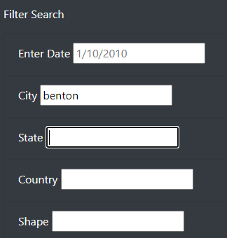
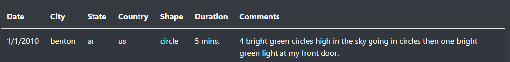

# UFOs

## Overview
The purpose of this project is to provide UFO enthusiasts with table of UFO sitings that they can filter to access targeted information.

## Results
To apply the filter, enter the information you are looking for in the input fields.  The table will be updated to display only the pertinent data.

## Summary
One drawback of the current site is that the filter is very rigid and specific.  It is case sensitve and does not account for alternate date formats.

The site could be improved by updating the code to account for user behavior so that it is no long case sensitive and dependent on a single date form.  Another way to account for user behavior might be to use a drop down menu or an autocomplete feature to ensure that the filter was updated with the appropriate form of the data.
